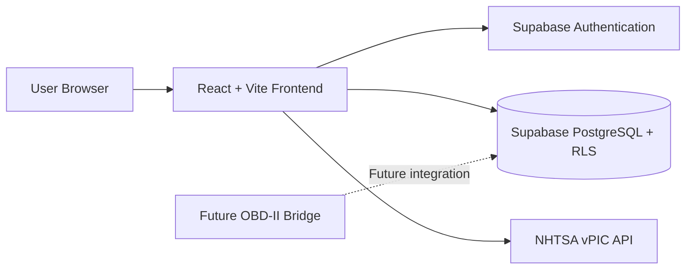

# Online Garage

Online Garage is a full-stack vehicle management platform that helps drivers organize vehicles, decode VIN information, track maintenance history, and prepare for future OBD-II telemetry integration.

The application is built with React, Vite, Supabase Authentication, PostgreSQL, and Row Level Security. Users can securely manage their own vehicles and maintenance records, while NHTSA vPIC integration provides structured vehicle and VIN information.

Current status: Authentication, vehicle management, VIN decoding, and maintenance tracking are implemented. Real OBD-II synchronization and AI-assisted symptom analysis remain under development.

## Table of Contents

1. [Project Overview](#project-overview)
2. [Problem Being Solved](#problem-being-solved)
3. [Current Implementation Status](#current-implementation-status)
4. [Implemented Features](#implemented-features)
5. [Technology Stack](#technology-stack)
6. [System Architecture](#system-architecture)
7. [Database and Security](#database-and-security)
8. [Project Structure](#project-structure)
9. [Local Development Setup](#local-development-setup)
10. [Required Environment Variables](#required-environment-variables)
11. [Running Lint and Build Validation](#running-lint-and-build-validation)
12. [Current Limitations](#current-limitations)
13. [Development Roadmap](#development-roadmap)
14. [Disclaimer](#disclaimer)
15. [Screenshots](#screenshots)
16. [Capstone and Future-Product Context](#capstone-and-future-product-context)

## Project Overview

Online Garage gives a driver one place to keep track of every vehicle they own: what it is, how many miles it has, what's been serviced, and (eventually) how it's running in real time. A user signs up, adds one or more vehicles either by looking them up in the NHTSA vehicle database or by decoding a VIN, and then logs maintenance history against each vehicle. All data is private to the account that created it.

## Problem Being Solved

Vehicle owners typically split this information across paper receipts, spreadsheets, and memory. There is rarely a single, structured, per-vehicle record of what a car is and what has been done to it — and no lightweight way to identify a vehicle precisely (year/make/model or VIN) before logging that history. Online Garage centralizes vehicle identification and maintenance history behind authenticated, per-user storage, and lays the groundwork for pulling in real telemetry once a vehicle is instrumented.

## Current Implementation Status

| Area | Status |
| --- | --- |
| Supabase authentication (signup, login, logout, session persistence) | Implemented |
| Protected routes | Implemented |
| Authenticated home dashboard | Implemented |
| Multi-vehicle garage (create, list, delete) | Implemented |
| NHTSA Year → Make → Model selection | Implemented |
| NHTSA VIN decoding | Implemented |
| Maintenance record CRUD (create, edit, delete) | Implemented |
| Vehicle-specific dashboard | Implemented |
| Telemetry database schema (`vehicle_data_logs`) | Implemented (schema only) |
| Real OBD-II telemetry sync | Not implemented |
| Symptom checker | Implemented as a rule-based, client-side demo (static data, not yet connected to Supabase or a real vehicle) |
| Automated React integration tests | Not implemented |
| Deployment | Not currently available |

## Implemented Features

- **Authentication** — Supabase-backed signup, login, logout, and persistent sessions via `onAuthStateChange`.
- **Protected routes** — `/home`, `/garage`, `/vehicles/:vehicleId`, `/vehicles/:vehicleId/maintenance`, and `/symptom-checker` require an authenticated session and redirect to `/login` otherwise.
- **Public landing page** — marketing/overview page at `/` shown to signed-out visitors; authenticated visitors are redirected to `/home`.
- **Authenticated home dashboard (`/home`)** — personalized greeting, garage summary counts, up to three vehicle preview cards, and quick actions for adding a vehicle, opening the garage, running the symptom checker, and jumping to maintenance.
- **My Garage (`/garage`)** — lists every vehicle owned by the signed-in user and includes an Add Vehicle form.
- **Vehicle identification, two ways:**
  - **VIN decoding** — enter a 17-character VIN and decode it against the NHTSA `DecodeVinValues` API to autofill year, make, and model (plus series, trim, engine, fuel type, and drive type when available).
  - **Year → Make → Model** — a searchable manufacturer combobox and dependent model dropdown, both backed by the NHTSA vPIC API (`GetMakesForVehicleType`, `GetModelsForMakeIdYear`), scoped to cars/trucks/MPVs and model year 1996+.
  - **Manual entry** — a fallback text-entry form for older or unlisted vehicles.
- **Vehicle deletion** — with a confirmation prompt before removing a vehicle and its related data.
- **Vehicle dashboard (`/vehicles/:vehicleId`)** — shows vehicle details, a telemetry card, and quick actions.
- **Maintenance log (`/vehicles/:vehicleId/maintenance`)** — persistent, per-vehicle CRUD for service records (service date, mileage, description, replaced parts, notes), sorted by date, with edit/cancel/delete flows and loading/error/empty states.
- **Row Level Security** — every table enforces ownership at the database level, in addition to Supabase auth on the client.
- **Rule-based symptom checker (`/symptom-checker`)** — a demo page that matches typed-in text against a small, static, in-memory list of symptom → issue/urgency/next-step rules (`frontend/src/data/mockData.js`) using substring matching. It is not a trained AI model, does not call an LLM, and is not yet wired to the `symptom_rules` table or the signed-in user's actual vehicles.

## Technology Stack

- **Frontend:** React 19, Vite, React Router
- **Backend-as-a-service:** Supabase (Authentication, PostgreSQL, Row Level Security)
- **External data:** NHTSA vPIC API (vehicle makes/models and VIN decoding)
- **Tooling:** ESLint, npm

The repository also contains the original Flask + Pandas + CSV prototype (`app/`, `data/`, `tests/`, `requirements.txt`) that the project migrated away from. It is kept for reference and is not part of the current application — see [Capstone and Future-Product Context](#capstone-and-future-product-context).

## System Architecture



The React frontend talks directly to Supabase (auth + database) and to the public NHTSA vPIC API from the browser; there is no custom backend server in the current architecture. A future OBD-II bridge would write telemetry into `vehicle_data_logs`, which the schema already supports.

## Database and Security

Supabase PostgreSQL schema (`supabase/migrations/20260718182747_initial_schema.sql`):

- **`vehicles`** — one row per vehicle, owned by `user_id`. Includes year, make, model, mileage, VIN, status, and telemetry snapshot columns (`battery_voltage`, `fuel_level`, `engine_temperature`, `dtc_code`, `last_synced_at`).
- **`maintenance_records`** — service history entries tied to a `vehicle_id` and `user_id`.
- **`vehicle_data_logs`** — append-only telemetry history table, prepared for future OBD-II ingestion. Clients may insert and read but never update or delete rows.
- **`symptom_rules`** — shared reference table for diagnostic suggestions. Readable by anyone; writable only via the privileged `service_role` key. The current frontend symptom checker does not read from this table yet.

Row Level Security is enabled on all four tables. Ownership policies restrict `select`/`insert`/`update`/`delete` on `vehicles` and `maintenance_records` to rows where `auth.uid() = user_id`, and `maintenance_records`/`vehicle_data_logs` writes additionally verify the referenced vehicle belongs to the same user. `symptom_rules` is publicly readable and has no client-facing write policy. Table/column grants mirror the RLS policies as defense in depth.

## Project Structure

```text
ai-automobile-capstone/
├── frontend/                      # Current React + Vite application
│   ├── src/
│   │   ├── pages/                 # LandingPage, LoginPage, SignupPage, HomePage,
│   │   │                          # GaragePage, DashboardPage, MaintenancePage,
│   │   │                          # SymptomCheckerPage
│   │   ├── components/            # Header, ProtectedRoute, VehicleCard,
│   │   │                          # VehicleSummaryCard, MaintenanceTable, TelemetryCard
│   │   ├── context/                # AuthContext / useAuth (Supabase session state)
│   │   ├── services/               # vehicleService, maintenanceService,
│   │   │                          # nhtsaVehicleService (Supabase + NHTSA calls)
│   │   ├── lib/supabaseClient.js  # Supabase client initialization
│   │   └── data/mockData.js       # Static data backing the symptom checker demo
│   ├── public/
│   ├── index.html
│   └── package.json
│
├── supabase/
│   ├── config.toml
│   └── migrations/                # SQL schema + RLS policies
│
├── app/, data/, tests/, requirements.txt   # Original Flask + CSV prototype (superseded, kept for reference)
│
├── docs/
└── README.md
```

## Local Development Setup

Requires Node.js (an LTS version compatible with Vite 8) and a Supabase project.

```bash
git clone https://github.com/horaetht/ai-automobile-capstone.git
cd ai-automobile-capstone/frontend
npm install
cp .env.example .env.local   # then fill in your Supabase project values
npm run dev
```

The dev server prints a local URL (Vite's default is `http://localhost:5173`).

To use your own Supabase backend, apply the schema in `supabase/migrations/` to a Supabase project before signing up in the app.

## Required Environment Variables

Set these in `frontend/.env.local` (not committed to git):

```env
VITE_SUPABASE_URL=
VITE_SUPABASE_PUBLISHABLE_KEY=
```

Both are read in `frontend/src/lib/supabaseClient.js` and are required — the app throws on startup if either is missing. Use your Supabase project's URL and publishable (anon) API key; never commit real keys.

## Running Lint and Build Validation

From `frontend/`:

```bash
npm install
npm run lint
npm run build
```

`npm run build` runs Vite's production build, which also performs module-level checks. There is currently no automated test suite for the React frontend.

## Current Limitations

- **No real OBD-II integration.** The `vehicle_data_logs` table and vehicle telemetry columns exist, but nothing writes real telemetry to them. The dashboard's telemetry card shows a disabled "OBD Sync Not Connected" state.
- **No live telemetry collection.** Telemetry fields on a vehicle are `null` unless manually populated; there is no background sync, polling, or hardware bridge.
- **The symptom checker is rule-based, not AI.** It performs simple substring matching against a small static list in `frontend/src/data/mockData.js`. It does not call an LLM or any external AI service, and is not yet connected to the `symptom_rules` table or the user's real vehicles.
- **No automated React integration tests.** Validation today is `npm run lint` and `npm run build`; there is no Jest/Vitest/Playwright suite for the frontend. (The Flask prototype's `pytest` suite still exists under `tests/` but only covers the superseded Flask app.)
- **No deployment.** There is no hosted/production instance linked from this repository at this time.

## Development Roadmap

- Connect the symptom checker to the `symptom_rules` table and the signed-in user's actual vehicles.
- Real OBD-II or connected-vehicle telemetry ingestion into `vehicle_data_logs`.
- Automated frontend integration tests.
- Maintenance reminders and cross-vehicle alerts (explicitly deferred from the home dashboard work).
- Production deployment.

## Disclaimer

Online Garage provides general guidance on vehicle maintenance and common symptoms. It does not replace professional mechanic expertise, and the symptom checker is a simple rule-based demo, not a diagnostic AI system. Always consult a certified mechanic for accurate diagnosis and repairs, especially for urgent vehicle issues.

## Screenshots

### Public Landing Page

<!-- Add screenshot: docs/screenshots/landing-page.png -->

### Authentication

<!-- Add screenshot: docs/screenshots/login-page.png -->

### Authenticated Home Dashboard

<!-- Add screenshot: docs/screenshots/home-dashboard.png -->

### My Garage

<!-- Add screenshot: docs/screenshots/garage-page.png -->

### VIN Decoding

<!-- Add screenshot: docs/screenshots/vin-decoding.png -->

### Vehicle Dashboard

<!-- Add screenshot: docs/screenshots/vehicle-dashboard.png -->

### Maintenance Log

<!-- Add screenshot: docs/screenshots/maintenance-log.png -->

## Capstone and Future-Product Context

Online Garage began as a standalone, single-file rule-based symptom checker and was built out into a broader vehicle management platform over the course of a capstone project. The original prototype (`app/`, `data/`, `tests/`) was a Flask application backed by CSV files with no authentication and a single shared demo vehicle; it has been fully superseded by the React + Supabase implementation described in this README but is retained in the repository for historical reference rather than deleted outright.

Beyond the capstone submission, the intended direction is a real per-vehicle telemetry pipeline (OBD-II or a connected-vehicle API) feeding into the existing `vehicle_data_logs` schema, and a genuinely AI-assisted symptom checker layered on top of — not in place of — the current rule-based baseline.
